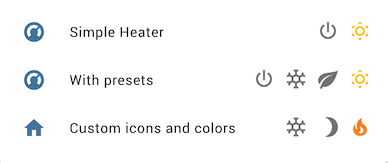

# climate-mode-entity-row



Show multiple climate preset and hvac mode on entity rows in Home Assistant's Lovelace UI

## Setup

Manually add [climate-mode-entity-row.js](https://raw.githubusercontent.com/piitaya/lovelace-climate-mode-entity-row/master/climate-mode-entity-row.js)
to your `<config>/www/` folder and add the following to your `ui-lovelace.yaml` file:

```yaml
resources:
  - url: /local/climate-mode-entity-row.js
    type: module
```

OR install using [HACS](https://hacs.xyz/) and add this instead:

```yaml
resources:
  - url: /community_plugin/lovelace-climate-mode-entity-row/climate-mode-entity-row.js
    type: module
```

## Options

| Name | Type | Required | Description
| :---- | :---- | :---- | :----
| type    | string | Yes  | `custom:climate-mode-entity-row`
| entity  | string | Yes  | `domain.my_entity_id`
| name    | string | No   | Override entity `friendly_name`
| icon    | string | No   | Override entity `icon`
| | | |
| modes | object | Yes | Modes (see below)

### Mode objects

| Name | Type | Required | Description
:---- | :---- | :---- | :----
| icon        | string  | No | A icon for the mode
| hvac_mode   | string  | No | A valid hvac_mode for the entity
| preset_mode | string  | No | A valid preset_mode for the entity
| color       | string  | No | Custom color for the icon when toggle

## Example

### Basic config


```yaml
type: entities
entities:
  - entity: climate.thermostat_kitchen
    type: 'custom:climate-mode-entity-row'
    modes:
      - hvac_mode: 'off'
      - preset_mode: eco
      - preset_mode: comfort
```

### Custom config


```yaml
type: entities
entities:
  - entity: climate.thermostat_kitchen
    type: 'custom:climate-mode-entity-row'
    modes:
      - hvac_mode: 'off'
        icon: 'mdi:snowflake'
        color: '#B3E5FC'
      - preset_mode: eco
        icon: 'mdi:moon-waxing-crescent'
        color: '#9575CD'
      - icon: 'mdi:weather-sunny'
        preset_mode: comfort
        color: '#FFC107'

```
